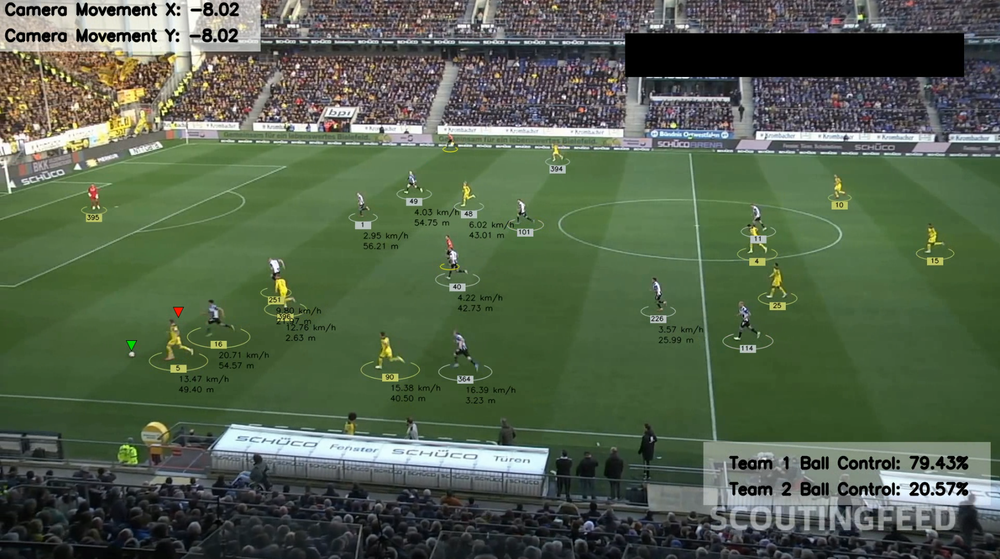

<div align="center">

# ⚽ Football Match Analytics — Computer Vision Pipeline

**End-to-end football video analysis using deep learning, multi-object tracking, and perspective geometry.**

[](https://www.python.org/)
[](https://github.com/ultralytics/ultralytics)
[](https://opencv.org/)
[](LICENSE)



</div>

---

## 🧠 What This Project Does

Most football analytics tools are locked behind expensive broadcast infrastructure. This project brings **professional-grade match analysis** to any game footage — detecting players, tracking their movement, measuring speed, and estimating ball possession automatically.

Given a raw match video, the pipeline outputs:

- 🟢 **Player & ball detection** with YOLOv8 (custom-trained weights)
- 🔁 **Multi-object tracking** with ByteTrack — IDs persist across frames even through occlusion
- 👕 **Automatic team assignment** via jersey color clustering (KMeans)
- 📐 **Perspective-corrected positioning** — pixel coordinates → real-world field meters
- 📷 **Camera motion compensation** using Lucas-Kanade optical flow
- 🏃 **Per-player speed (km/h) and distance covered (m)**
- ⚽ **Frame-by-frame ball possession** with team-level aggregation
- 🎬 **Annotated video output** with overlays for all the above

---

## 🏗️ Architecture Overview

```
Video Input
    │
    ▼
┌──────────────────────────────────────────┐
│  YOLO Detection  →  ByteTrack Tracking   │  trackers/
└──────────────────────────────────────────┘
    │
    ▼
┌──────────────────────────────────────────┐
│  Camera Motion Estimation (Lucas-Kanade) │  camera_movement_estimator/
│  → Position Compensation per Frame       │
└──────────────────────────────────────────┘
    │
    ▼
┌──────────────────────────────────────────┐
│  Perspective Transform (Homography)      │  view_transformer/
│  Pixel Space → Real-World Field Coords   │
└──────────────────────────────────────────┘
    │
    ▼
┌──────────────────────────────────────────┐
│  Ball Interpolation (Pandas)             │
│  Speed & Distance Estimation             │  speed_and_distance_estimator/
└──────────────────────────────────────────┘
    │
    ▼
┌──────────────────────────────────────────┐
│  Team Color Clustering (KMeans)          │  team_assigner/
│  Ball Possession Assignment              │  player_ball_assigner/
└──────────────────────────────────────────┘
    │
    ▼
Annotated Video Output
```

---

## 🔍 Technical Highlights

**Tracking Robustness**
Ball detections are often noisy or missing across frames. Rather than propagating gaps, I use Pandas interpolation with directional fill to reconstruct a smooth, continuous ball trajectory.

**Camera Motion Problem**
In broadcast football, the camera pans constantly — which makes player motion estimates meaningless in pixel space. I extract stable background features using `goodFeaturesToTrack`, track them across frames with Lucas-Kanade optical flow, and subtract the dominant camera shift from all object positions before any analytics runs.

**Real-World Coordinates**
Speed and distance can't be computed in pixels. I define four known pitch points (in pixels and real-world meters), compute a homography matrix via `getPerspectiveTransform`, and project all compensated positions into field coordinates before doing any motion math.

**Team Assignment**
No labeling required. For each player bounding box, I take the top half (avoiding pitch bleed), run a 2-cluster KMeans on pixel colors, filter out the background cluster by checking image corners, and use the remaining cluster center as the jersey color. A second KMeans across all players separates Team 1 from Team 2.

**Possession Heuristic**
Ball possession is assigned per frame using minimum-distance to player foot positions, with a configurable threshold. Cumulative team possession percentages are overlaid in real-time on the output video.

---

## 🛠️ Tech Stack

| Library | Role |
|---|---|
| [Ultralytics YOLOv8](https://github.com/ultralytics/ultralytics) | Object detection |
| [Supervision + ByteTrack](https://github.com/roboflow/supervision) | Multi-object tracking |
| [OpenCV](https://opencv.org/) | Frame processing, optical flow, perspective transform |
| [scikit-learn](https://scikit-learn.org/) | KMeans jersey color clustering |
| [Pandas](https://pandas.pydata.org/) | Ball position interpolation |
| [NumPy](https://numpy.org/) | Numerical operations |
| [FilterPy](https://github.com/rlabbe/filterpy) | Kalman filter support |

---

## 📁 Project Structure

```
Football_Analysis/
├── main.py                          # Entry point — runs full pipeline
├── requirements.txt
│
├── trackers/
│   └── tracker.py                   # YOLO detection + ByteTrack + annotation drawing
│
├── team_assigner/
│   └── team_assigner.py             # KMeans jersey color → team ID assignment
│
├── player_ball_assigner/
│   └── player_ball_assigner.py      # Nearest-player ball possession logic
│
├── camera_movement_estimator/
│   └── camera_movement_estimator.py # Lucas-Kanade optical flow compensation
│
├── view_transformer/
│   └── view_transformer.py          # Homography: pixels → real-world meters
│
├── speed_and_distance_estimator/
│   └── speed_and_distnace_estimator.py  # Speed (km/h) + cumulative distance
│
├── utils/
│   ├── video_utils.py               # read_video / save_video helpers
│   └── bobx_utils.py                # BBox geometry utilities
│
├── stubs/                           # Cached detections & camera movement (for fast re-runs)
├── development_and_analysis/        # Notebooks for color clustering exploration
└── output_videos/                   # Annotated output
```

---

## 🚀 Getting Started

### 1. Clone and install

```bash
git clone https://github.com/your-username/Football_Analysis.git
cd Football_Analysis
pip install -r requirements.txt
```

### 2. Add model weights and input video

By default, `main.py` expects:
- Model weights → `models/best.pt`
- Input video → `test/test (19).mp4`

Download them here:

| Asset | Link |
|---|---|
| YOLO weights (`best.pt`) | [Google Drive](https://drive.google.com/file/d/1DC2kCygbBWUKheQ_9cFziCsYVSRw6axK/view?usp=sharing) |
| Sample match video | [Google Drive](https://drive.google.com/file/d/1t6agoqggZKx6thamUuPAIdN_1zR9v9S_/view?usp=sharing) |

### 3. Run

```bash
python main.py
```

Output saved to: `output_videos/output_video.avi`

---

## ⚡ Fast Re-runs with Stubs

Detection and camera motion estimation are the most expensive steps. Pre-computed results are cached as stubs:

```
stubs/track_stubs.pkl
stubs/camera_movement_stub.pkl
```

These are enabled by default in `main.py`. To run everything fresh end-to-end:

```python
# In main.py, change these two calls:
tracker.get_object_tracks(..., read_from_stub=False)
camera_movement_estimator.get_camera_movement(..., read_from_stub=False)
```

---

## 📊 Output Overlays

Each output frame contains:

- **Colored ellipses** under players (team color-coded)
- **Player IDs** in small rectangles
- **Green triangle** above the ball
- **Red triangle** on the player currently in possession
- **Team ball control %** — cumulative, shown in bottom-right panel
- **Camera shift (X/Y)** — shown in top-left panel
- **Speed (km/h) and distance (m)** — overlaid near each player's feet

---

## ⚠️ Current Limitations

- Input/output paths are hardcoded in `main.py` — config file or CLI args would be a clean improvement
- Perspective transform vertices are manually defined for a single camera view — not generalizable out of the box
- Team color clustering initializes from the **first frame only** — might fail on extreme lighting changes mid-match
- Possession uses a simple nearest-distance heuristic — no physics or velocity context
- Frame rate is hardcoded at **24 FPS** for speed calculations — should be auto-detected from video metadata

---

## 📄 License

[MIT](LICENSE) — free to use, modify, and build on. Attribution appreciated.

---

<div align="center">
  <sub>Built with curiosity and way too many hours of football footage.</sub>
</div>
